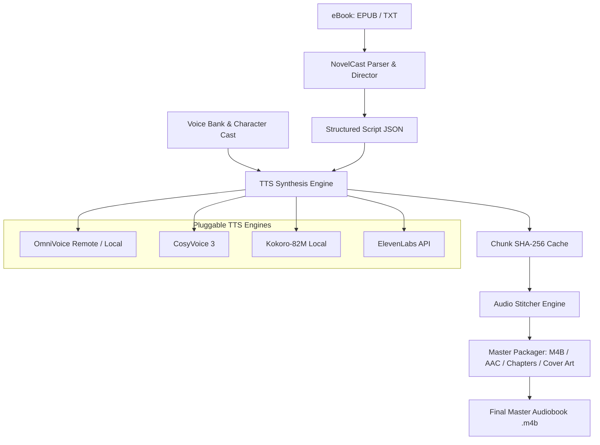

# 🎙️ NovelCast: Multi-Voice AI Audiobook Studio

<p align="center">
  <b>The Open-Source Multi-Voice AI Audiobook Studio for Light Novels, Fiction & Dramatized Audiobooks.</b>
</p>

<p align="center">
  
  
  
  
</p>

---

## 🌟 Why NovelCast?

Most audiobook tools read books with a **single flat voice**. Full-cast audiobooks are immersive, but traditionally take hundreds of studio recording hours.

**NovelCast** automates the entire journey from an eBook (EPUB, TXT) to a **broadcast-quality multi-voice, dramatized `.m4b` audiobook**:

- 🎭 **Smart Character Casting & Dialogue Segmentation**: Detects character dialogue vs. narrative prose with emotional context prompts (`[laughter]`, `[whisper]`, `[gasp]`, `[groan]`).
- ⚡ **Pluggable Multi-TTS Engine**:
  - **OmniVoice**: Ultra-expressive voice cloning with Dual-GPU remote acceleration.
  - **CosyVoice / CosyVoice 3**: State-of-the-art multilingual zero-shot voice cloning.
  - **Kokoro-82M**: Fast, lightweight local CPU/GPU fallback.
  - **ElevenLabs**: Cloud API integration.
- 🔄 **Chunk-Level SHA-256 Deduplication**: Edit a single line or fix a voice without re-synthesizing the entire book.
- 🎧 **Smart Conversational Audio Stitching**: Natural inter-speaker pause insertion (monologue vs. dialogue transitions vs. scene breaks) and LUFS loudness leveling.
- 📦 **Master Packaging**: Creates standard `.m4b` files with embedded high-res cover art and chapter navigation markers.
- 🖥️ **CLI & Future GUI Ready**: Modular Python SDK with a built-in REST API server for future Web/Desktop GUI interfaces.

---

## 🚀 Quickstart

### 1. Installation

```bash
git clone https://github.com/your-username/novelcast.git
cd novelcast

# Create virtual environment
python3 -m venv venv
source venv/bin/activate

# Install NovelCast with CLI support
pip install -e .
```

### 2. Run End-to-End in One Command

```bash
novelcast run "book.epub" \
  --title "Re:Zero Volume 2" \
  --author "Tappei Nagatsuki" \
  --engine omnivoice \
  --remote "http://192.168.0.180:9880/synthesize" \
  --cover "cover.jpg" \
  --output "output/Re_Zero_Vol_02.m4b"
```

---

## 🛠️ CLI Subcommands

NovelCast provides modular subcommands for full control over every stage of production:

| Command | Description |
| :--- | :--- |
| `novelcast init` | Initialize a new audiobook project workspace |
| `novelcast parse <book.epub>` | Parse eBook into structured chapter JSON scripts |
| `novelcast voices list` | Display character voice casting table and reference audio |
| `novelcast voices test <name>` | Synthesize a live test audio clip for any character voice |
| `novelcast generate <dir>` | Batch synthesize audio chunks with live GPU progress bars |
| `novelcast stitch <dir>` | Combine audio chunks into seamless chapter MP3 tracks |
| `novelcast package <dir>` | Package chapters into a master `.m4b` audiobook |
| `novelcast serve` | Start the REST API server for Web & Desktop GUIs |

### Auditioning Character Voices

```bash
# List all character voice profiles
novelcast voices list

# Test Emilia's voice with a sample phrase
novelcast voices test "Emilia" --text "Hola Subaru, qué bueno verte despierto."
```

---

## 🏛️ Architecture



---

## ⚙️ Voice Configuration (`voice_config.json`)

Character profiles are defined with instruct prompts, speed, and reference audio clips for cloning:

```json
{
  "default_narrator": "Narrador",
  "characters": {
    "Narrador": {
      "gender": "male",
      "description": "Narrador cinematográfico y envolvente",
      "instruct": null,
      "speed": 1.0,
      "guidance_scale": 2.8,
      "pause_after_ms": 500
    },
    "Subaru": {
      "gender": "male",
      "instruct": "male, teenager, moderate pitch",
      "speed": 1.0,
      "guidance_scale": 2.8,
      "pause_after_ms": 400,
      "reference_audio": "voice_bank/subaru.wav"
    },
    "Emilia": {
      "gender": "female",
      "instruct": "female, young adult, high pitch",
      "speed": 1.0,
      "guidance_scale": 2.8,
      "pause_after_ms": 400,
      "reference_audio": "voice_bank/emilia.wav"
    }
  }
}
```

---

## 🖥️ Future GUI Roadmap

NovelCast includes a built-in REST API server (`novelcast serve`) designed to power a future **Web Studio & Desktop App**:

- 📝 **Visual Script Editor**: Interactive line-by-line dialogue viewer.
- 🎙️ **Click-to-Audition**: Click any sentence to play its audio chunk immediately.
- 🔄 **Instant Line Re-Take**: Change character speaker attribution or emotional prompt and regenerate in milliseconds.
- 📊 **Live Waveform & Timeline Visualization**.

---

## 📄 License

NovelCast is licensed under the [MIT License](LICENSE).
