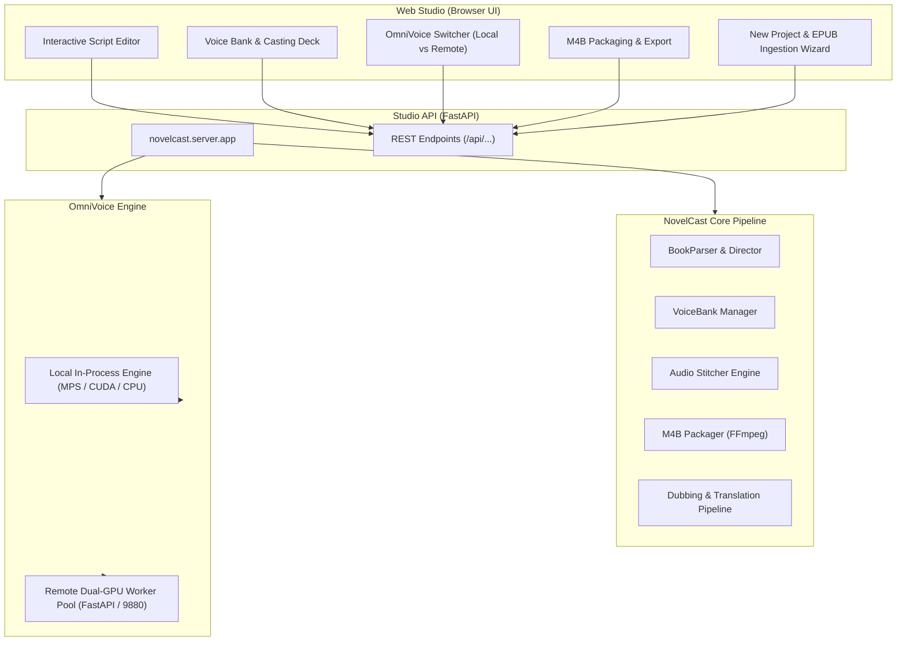

# NovelCast: Multi-Voice AI Audiobook Studio

<p align="center">
  <b>The Open-Source Multi-Voice AI Audiobook Studio for Light Novels, Fiction & Dramatized Audiobooks.</b>
</p>

<p align="center">
  
  
  
  
  
</p>

---

## Overview

Most audiobook tools read books with a single flat narrator voice. Full-cast audiobooks provide an immersive listening experience, but traditionally require hundreds of studio recording hours.

**NovelCast** automates the end-to-end production workflow from an eBook (EPUB, TXT) or audio recording to a high-quality multi-voice `.m4b` audiobook:

- **🖥️ NovelCast Web Studio**: Interactive visual workstation for line-by-line script editing, 1-click single-line re-rolls, voice casting auditioning, chapter stitching, and M4B packaging.
- **✨ New Project & EPUB Ingestion Wizard**: Drag and drop any `.epub` file to automatically parse chapters, attribute character dialogues, and extract embedded cover art.
- **⚡ Dual-Mode OmniVoice Engine**: Seamlessly toggle between a **Remote Dual-GPU Worker Pool** (high-throughput parallel batch generation) and a **Local In-Process Engine** (Apple Silicon `mps` / CUDA / CPU) for offline auditioning.
- **Smart Character Casting & Dialogue Segmentation**: Automatically detects character dialogue versus narrative prose with context-aware emotion prompts.
- **Pluggable TTS Engines**: Supports OmniVoice, CosyVoice 3, Kokoro-82M, and ElevenLabs.
- **Chunk-Level SHA-256 Deduplication**: Edit a single line or tweak a character's tone without re-synthesizing unchanged sections.
- **Conversational Audio Stitching**: Natural inter-speaker pause insertion and LUFS loudness normalization.
- **Master Packaging**: Produces standard `.m4b` containers with embedded high-resolution cover art and chapter navigation markers.
- **Cross-Lingual Dubbing**: Voice-preserving zero-shot translation and dubbing for foreign-language audiobooks.

---

## Quickstart: Web Studio

Launch the NovelCast Web Studio with a single command:

```bash
# Start the Web Studio
novelcast serve --port 8000
```

Open your browser to **`http://localhost:8000`** to access:
1. **Script Studio**: View lines with character avatars, edit text inline, and hit **⚡ Re-roll** to re-synthesize any line in <1s.
2. **Voice Casting Deck**: Audition reference voice samples (`narrador.wav`, `emilia.wav`, `subaru.wav`) and assign voices to characters.
3. **M4B Packaging Studio**: Preview cover art, adjust pause timings, and package the master `.m4b` with 1 click.
4. **New Project Wizard (➕)**: Drag-and-drop `.epub` eBooks to create and parse new audiobook projects in seconds.

---

## Installation

```bash
git clone https://github.com/RockNCode/novelcast.git
cd novelcast

# Create virtual environment
python3 -m venv venv
source venv/bin/activate  # On Windows: venv\Scripts\activate

# Install NovelCast with CLI and Web Studio support
pip install -e .
```

---

## CLI Usage

NovelCast provides modular CLI subcommands for script automation and headless batch workflows:

| Command | Description |
| :--- | :--- |
| `novelcast serve` | **Start the NovelCast Web Studio UI** on `http://localhost:8000` |
| `novelcast init` | Initialize a new audiobook project workspace |
| `novelcast parse <book.epub>` | Parse eBook into structured chapter JSON scripts |
| `novelcast voices list` | Display character voice casting table and reference audio |
| `novelcast voices test <name>` | Synthesize a live test audio clip for any character voice |
| `novelcast generate <dir>` | Batch synthesize audio chunks with multi-worker GPU acceleration |
| `novelcast stitch <dir>` | Combine audio chunks into seamless chapter MP3 tracks |
| `novelcast package <dir>` | Package chapters into a master `.m4b` audiobook with cover art |
| `novelcast dub <audio.m4b>` | Translate and dub an existing audiobook while cloning original voices |
| `novelcast run <book.epub>` | Run the complete end-to-end production pipeline in one command |

---

### Running End-to-End Synthesis via CLI

#### A. Remote GPU Server Offloading (Dual-GPU or Cloud Server)
```bash
novelcast run "book.epub" \
  --title "Re:Zero Volume 3" \
  --author "Tappei Nagatsuki" \
  --engine omnivoice \
  --remote "http://192.168.0.180:9880/synthesize" \
  --workers 4 \
  --cover "cover.jpg" \
  --output "output/Re_Zero_Vol_03.m4b"
```

#### B. Local Execution (NVIDIA CUDA or Apple Silicon MPS)
```bash
novelcast run "book.epub" \
  --title "Re:Zero Volume 3" \
  --author "Tappei Nagatsuki" \
  --engine omnivoice \
  --cover "cover.jpg" \
  --output "output/Re_Zero_Vol_03.m4b"
```

---

## Architecture



---

## Voice Configuration (`voice_config.json`)

Character profiles are defined with instruct prompts, speed, and reference audio clips for cloning:

```json
{
  "default_narrator": "Narrador",
  "characters": {
    "Narrador": {
      "gender": "male",
      "description": "Narrador cinematográfico y envolvente",
      "instruct": null,
      "speed": 1.0,
      "guidance_scale": 2.8,
      "pause_after_ms": 500,
      "reference_audio": "voice_bank/narrador.wav"
    },
    "Subaru": {
      "gender": "male",
      "instruct": "male, teenager, moderate pitch",
      "speed": 1.0,
      "guidance_scale": 2.8,
      "pause_after_ms": 400,
      "reference_audio": "voice_bank/subaru.wav"
    },
    "Emilia": {
      "gender": "female",
      "instruct": "female, young adult, high pitch",
      "speed": 1.0,
      "guidance_scale": 2.8,
      "pause_after_ms": 400,
      "reference_audio": "voice_bank/emilia.wav"
    }
  }
}
```

---

## License

NovelCast is licensed under the [MIT License](LICENSE).
