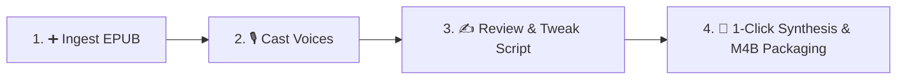
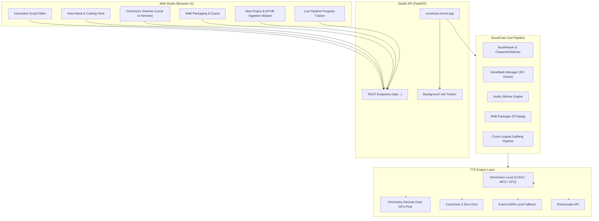

# NovelCast: Multi-Voice AI Audiobook Studio

<p align="center">
  <b>The Open-Source Multi-Voice AI Audiobook Studio for Light Novels, Fiction & Dramatized Audiobooks.</b>
</p>

<p align="center">
  
  
  
  
  
</p>

---

## Overview

Most audiobook tools read books with a single flat narrator voice. Full-cast audiobooks provide an immersive listening experience, but traditionally require hundreds of studio recording hours.

**NovelCast** automates the end-to-end production workflow from an eBook (EPUB, TXT) or existing audio recording to a high-quality multi-voice `.m4b` audiobook:

- **🖥️ NovelCast Web Studio**: Interactive visual workstation for line-by-line script editing, 1-click single-line re-rolls, voice casting auditioning, chapter stitching, and M4B packaging.
- **✨ 1-Click Production & Ingestion Wizard**: Drag and drop any `.epub` file to automatically parse chapters, discover speaking characters, synthesize speech chunks, stitch audio, and package the final Master M4B in one shot.
- **🔍 Smart Character Discovery**: Scans book dialogue, calculates line counts/percentages, quotes sample lines, and auto-matches reference voices from the Voice Bank.
- **⚡ Dual-Mode OmniVoice Engine**: Seamlessly toggle between a **Remote Dual-GPU Worker Pool** (high-throughput parallel batch generation) and a **Local In-Process Engine** (Apple Silicon `mps` / CUDA / CPU) for offline auditioning.
- **📊 Real-Time Progress Tracking**: Live glowing progress bars, step-by-step pipeline tracker, and streaming terminal logs.
- **🎙️ Curated Voice Bank (25+ Voices)**: Includes studio-grade reference samples for iconic narrators (*Enrique Rocha, Jane, AMLO, Cherry Twinkle, Adam, Bella, Brian, etc.*).
- **Chunk-Level SHA-256 Deduplication**: Edit a single line or tweak a character's tone without re-synthesizing unchanged sections.
- **Conversational Audio Stitching**: Natural inter-speaker pause insertion and LUFS loudness normalization.
- **Master Packaging**: Produces standard `.m4b` containers with embedded high-resolution cover art and chapter navigation markers.
- **Cross-Lingual Dubbing**: Voice-preserving zero-shot translation and dubbing for foreign-language audiobooks.

---

## Quickstart: Web Studio

Launch the NovelCast Web Studio with a single command:

```bash
# Start the Web Studio UI
novelcast serve --port 8000
```

Open your browser to **`http://localhost:8000`** to access the complete studio.

---

## 📖 Web Studio Walkthrough & Tutorial

Producing a full dramatized multi-voice audiobook takes just 4 intuitive steps:



### Step 1: Ingest eBook (`➕ New Project`)
1. Click **`➕ New Project`** in the top navigation bar.
2. Drag and drop your `.epub` novel (or enter a file path).
3. NovelCast automatically extracts chapters, separates character dialogue from narrative prose, and grabs high-resolution embedded cover art.

### Step 2: Auto-Detect Characters & Cast Voices (`Voice Casting` Tab)
1. Switch to the **Voice Casting** tab.
2. Click **`🔍 Auto-Detect Characters`** (or let it auto-populate upon project load).
3. Review every speaking character with their **dialogue line counts** (e.g. *Subaru: 879 lines • 64.8%, Emilia: 200 lines • 14.7%*).
4. Click **`▶`** on any card to audition voice samples from the Voice Bank.
5. Select voice assignments from the dropdowns and click **`💾 Save Casting`**.

### Step 3: Review & Audition Dialogue (`Script Studio` Tab)
1. Switch to the **Script Studio** tab.
2. Browse through chapters using the chapter selector dropdown.
3. Click **`▶`** next to any sentence to immediately listen to it in the persistent bottom audio player.
4. **1-Click Line Reroll (⚡)**: If any line needs a different speaker or delivery tone (*Whisper, High Pitch, Angry, etc.*), change the dropdown and click **`⚡`** to re-synthesize that line in <1s.

### Step 4: 1-Click Production & Master M4B Packaging (`Packaging` Tab)
1. Click **`🚀 1-Click Production`** in the header (or switch to the Packaging tab).
2. Watch the **Real-Time Progress Modal** guide you through the 4-step pipeline:
   - 📖 **Parse eBook** (✓ Done)
   - ⚡ **Synthesize Speech Chunks** (Live chunk counter & percentage)
   - 🎧 **Stitch Chapter Tracks** (Automatic pause insertion & LUFS leveling)
   - 📦 **Package Master M4B** (Embedded cover art & chapter markers)
3. When finished, click **`⬇️ Download Master M4B Audiobook`**!

---

## Installation

```bash
git clone https://github.com/RockNCode/novelcast.git
cd novelcast

# Create virtual environment
python3 -m venv venv
source venv/bin/activate  # On Windows: venv\Scripts\activate

# Install NovelCast with CLI and Web Studio support
pip install -e .
```

---

## CLI Usage

NovelCast provides modular CLI subcommands for headless pipelines and automation:

| Command | Description |
| :--- | :--- |
| `novelcast serve` | **Start the NovelCast Web Studio UI** on `http://localhost:8000` |
| `novelcast run <book.epub>` | **Run the complete end-to-end production pipeline** in one command |
| `novelcast init` | Initialize a new audiobook project workspace |
| `novelcast parse <book.epub>` | Parse eBook into structured chapter JSON scripts |
| `novelcast voices list` | Display character voice casting table and reference audio |
| `novelcast voices test <name>` | Synthesize a live test audio clip for any character voice |
| `novelcast generate <dir>` | Batch synthesize audio chunks with multi-worker GPU acceleration |
| `novelcast stitch <dir>` | Combine audio chunks into seamless chapter MP3 tracks |
| `novelcast package <dir>` | Package chapters into a master `.m4b` audiobook with cover art |
| `novelcast dub <audio.m4b>` | Translate and dub an existing audiobook while cloning original voices |

---

### Running Synthesis via CLI

#### A. Remote GPU Server Offloading (Dual-GPU or Cloud Server)
```bash
novelcast run "book.epub" \
  --title "Re:Zero Volume 3" \
  --author "Tappei Nagatsuki" \
  --engine omnivoice \
  --remote "http://192.168.0.180:9880/synthesize" \
  --workers 4 \
  --cover "cover.jpg" \
  --output "output/Re_Zero_Vol_03.m4b"
```

#### B. Local Execution (NVIDIA GPU or Apple Silicon MPS)
```bash
novelcast run "book.epub" \
  --title "Re:Zero Volume 3" \
  --author "Tappei Nagatsuki" \
  --engine omnivoice \
  --cover "cover.jpg" \
  --output "output/Re_Zero_Vol_03.m4b"
```

#### C. On-Device Lightweight Fallback (CPU / Kokoro-82M)
```bash
novelcast run "book.epub" --engine kokoro --output "output/My_Audiobook.m4b"
```

---

## Architecture



---

## Voice Configuration (`voice_config.json`)

Character profiles are defined with instruct delivery prompts, speed, and reference audio clips for cloning:

```json
{
  "default_narrator": "Narrador",
  "characters": {
    "Narrador": {
      "gender": "male",
      "description": "Narrador cinematográfico y envolvente",
      "instruct": null,
      "speed": 1.0,
      "guidance_scale": 2.8,
      "pause_after_ms": 500,
      "reference_audio": "voice_bank/narrador.wav"
    },
    "Subaru": {
      "gender": "male",
      "instruct": "male, teenager, moderate pitch",
      "speed": 1.0,
      "guidance_scale": 2.8,
      "pause_after_ms": 400,
      "reference_audio": "voice_bank/subaru.wav"
    },
    "Emilia": {
      "gender": "female",
      "instruct": "female, young adult, high pitch",
      "speed": 1.0,
      "guidance_scale": 2.8,
      "pause_after_ms": 400,
      "reference_audio": "voice_bank/emilia.wav"
    }
  }
}
```

---

## License

NovelCast is licensed under the [MIT License](LICENSE).
