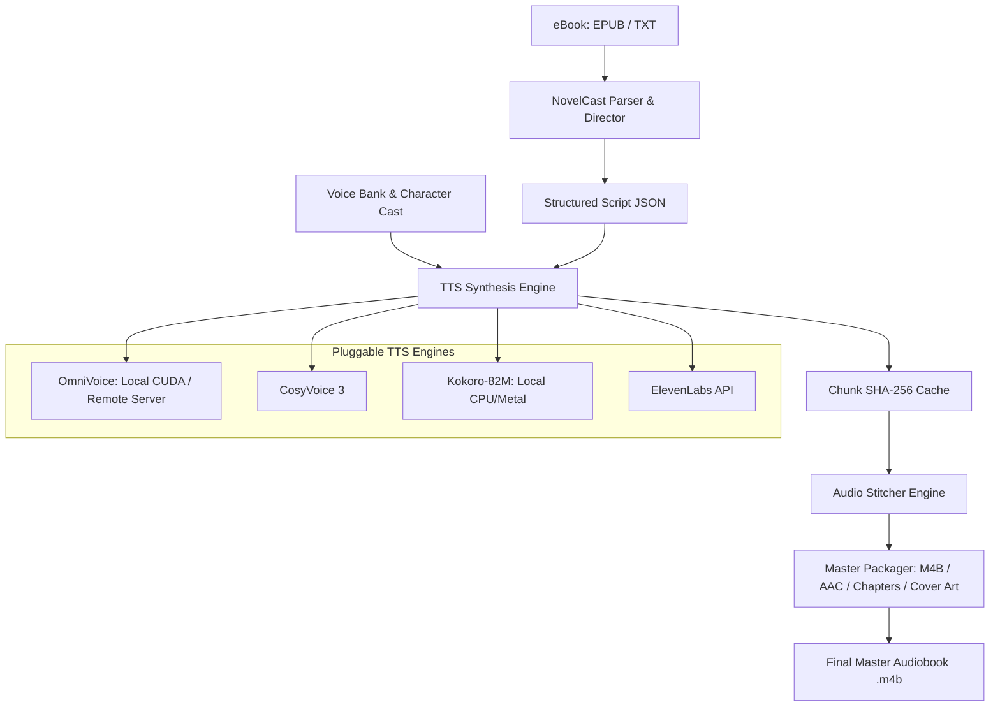

# NovelCast: Multi-Voice AI Audiobook Studio

<p align="center">
  <b>The Open-Source Multi-Voice AI Audiobook Studio for Light Novels, Fiction & Dramatized Audiobooks.</b>
</p>

<p align="center">
  
  
  
  
</p>

---

## Overview

Most audiobook tools read books with a single flat narrator voice. Full-cast audiobooks provide an immersive listening experience, but traditionally require hundreds of studio recording hours.

**NovelCast** automates the end-to-end production workflow from an eBook (EPUB, TXT) to a high-quality multi-voice `.m4b` audiobook:

- **Smart Character Casting & Dialogue Segmentation**: Automatically detects character dialogue versus narrative prose with context-aware emotion prompts.
- **Pluggable TTS Engines**:
  - **OmniVoice (Local & Remote)**: Voice cloning running directly on local NVIDIA GPUs (Windows/Linux) or offloaded to a remote GPU server.
  - **CosyVoice / CosyVoice 3**: Zero-shot multilingual voice cloning.
  - **Kokoro-82M**: Fast, lightweight on-device CPU/Metal fallback for any machine.
  - **ElevenLabs**: Cloud API integration.
- **Chunk-Level SHA-256 Deduplication**: Edit a single line or modify a character's voice without re-synthesizing unchanged sections.
- **Conversational Audio Stitching**: Natural inter-speaker pause insertion and LUFS loudness normalization.
- **Master Packaging**: Produces standard `.m4b` containers with embedded high-resolution cover art and chapter navigation markers.
- **CLI & REST API Architecture**: Clean Python package with a built-in FastAPI server for future Web and Desktop GUI interfaces.

---

## Quickstart

### 1. Installation

```bash
git clone https://github.com/RockNCode/novelcast.git
cd novelcast

# Create virtual environment
python3 -m venv venv
source venv/bin/activate  # On Windows: venv\Scripts\activate

# Install NovelCast with CLI support
pip install -e .
```

---

### 2. Running Synthesis

NovelCast supports both local on-device GPU inference and remote server offloading:

#### A. Local Execution (Windows / Linux with NVIDIA GPU)
If you have an NVIDIA GPU, install PyTorch with CUDA and run locally without needing a server:
```bash
pip install torch torchaudio omnivoice

# Run full pipeline locally in one command
novelcast run "book.epub" \
  --title "My Audiobook" \
  --author "Author Name" \
  --engine omnivoice \
  --cover "cover.jpg" \
  --output "output/My_Audiobook.m4b"
```

#### B. Remote GPU Server Offloading (Mac or Distributed Workflows)
If you are on a Mac or want to offload compute to a dedicated multi-GPU machine:
```bash
novelcast run "book.epub" \
  --title "My Audiobook" \
  --author "Author Name" \
  --engine omnivoice \
  --remote "http://192.168.0.180:9880/synthesize" \
  --workers 4 \
  --cover "cover.jpg" \
  --output "output/My_Audiobook.m4b"
```

#### C. On-Device Lightweight Fallback (CPU / Apple Silicon)
No GPU or server required:
```bash
novelcast run "book.epub" --engine kokoro --output "output/My_Audiobook.m4b"
```

---

## CLI Subcommands

NovelCast provides modular subcommands for full control over every stage of production:

| Command | Description |
| :--- | :--- |
| `novelcast init` | Initialize a new audiobook project workspace |
| `novelcast parse <book.epub>` | Parse eBook into structured chapter JSON scripts |
| `novelcast voices list` | Display character voice casting table and reference audio |
| `novelcast voices test <name>` | Synthesize a live test audio clip for any character voice |
| `novelcast generate <dir>` | Batch synthesize audio chunks with progress reporting |
| `novelcast stitch <dir>` | Combine audio chunks into seamless chapter MP3 tracks |
| `novelcast package <dir>` | Package chapters into a master `.m4b` audiobook |
| `novelcast dub <audio.m4b>` | Translate and dub an existing audiobook while cloning original voices |
| `novelcast serve` | Start the REST API server for Web & Desktop GUIs |

### Auditioning Character Voices

```bash
# List all character voice profiles
novelcast voices list

# Test a character's voice with a sample phrase
novelcast voices test "Emilia" --text "Hola Subaru, qué bueno verte despierto."
```

---

## Architecture



---

## Voice Configuration (`voice_config.json`)

Character profiles are defined with instruct prompts, speed, and reference audio clips for cloning:

```json
{
  "default_narrator": "Narrador",
  "characters": {
    "Narrador": {
      "gender": "male",
      "description": "Narrador cinematográfico y envolvente",
      "instruct": null,
      "speed": 1.0,
      "guidance_scale": 2.8,
      "pause_after_ms": 500
    },
    "Subaru": {
      "gender": "male",
      "instruct": "male, teenager, moderate pitch",
      "speed": 1.0,
      "guidance_scale": 2.8,
      "pause_after_ms": 400,
      "reference_audio": "voice_bank/subaru.wav"
    },
    "Emilia": {
      "gender": "female",
      "instruct": "female, young adult, high pitch",
      "speed": 1.0,
      "guidance_scale": 2.8,
      "pause_after_ms": 400,
      "reference_audio": "voice_bank/emilia.wav"
    }
  }
}
```

---

## Future GUI Roadmap

NovelCast includes a built-in REST API server (`novelcast serve`) designed to power a future Web Studio and Desktop App:

- **Visual Script Editor**: Interactive line-by-line dialogue viewer.
- **Click-to-Audition**: Click any sentence to play its audio chunk immediately.
- **Instant Line Re-Take**: Change character speaker attribution or emotional prompt and regenerate in milliseconds.
- **Waveform & Timeline Visualization**.

---

## License

NovelCast is licensed under the [MIT License](LICENSE).
